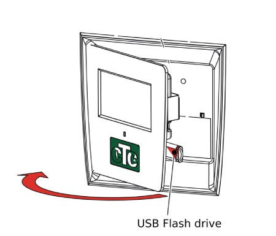

# CTC CSV

Parses CTC EcoZenith Heater CSV files for input to an influxdb database. I use Grafana for visualizing the heater data:

The script will find all csv files in a directory and parse the data, label it, making it timezone aware and push it to 
an influxdb database before deleting the csv files. It has only been tested with my own setup which consist of a 
CTC EcoZenith i250 immersion heater, CTC EcoAir 400 heat pump and one flow loop of underfloor heating.

The data has been identified with my setup manually an covers:
* Tank upper temperature
* Tank lower temperature
* Primary flow 1 temperature
* Return flow temperature
* Heat pump flow temperature
* Heat pump return temperature
* Heater electric power
* L1, L2, L3 and compressor L1 electric current
* Charge pump speed
* Compressor on/off

There are currently 20 more columns in the csv files which are not identified, although unknown_20 resembles the 
outdoor temperature quite good. I have uploaded one of my csv files for reference: [20200101.CSV](./resources/20200101.CSV)

# How to use

### Heater
1. Carefully open the touch screen lid and add an empty USB flash drive (FAT32) into the USB slot as indicated:

2. Start logging by following setting on the touch screen: Installer settings --> Service --> Write log to USB

As far as I have seen the flash drive can be removed and added without having to restart logging from the touch screen.

### Computer

Prerequisites:
* Python (with pandas, numpy and influxdb) installed
* Running Influxdb instance with a database called 'ctc'

Instructions:
1. Download the ctc.py file to a directory on your computer
2. Change following parameters in the start of the ctc.py file to accomodate your setup:
    * Timezone, default is 'CET'
    * Influxdb parameters (user/pass and optionally host/port/dbname)
3. Copy some csv files from the flash drive to the directory where the ctc.py file is
3. Run the script with following command from the directory: `python ctc.py`
